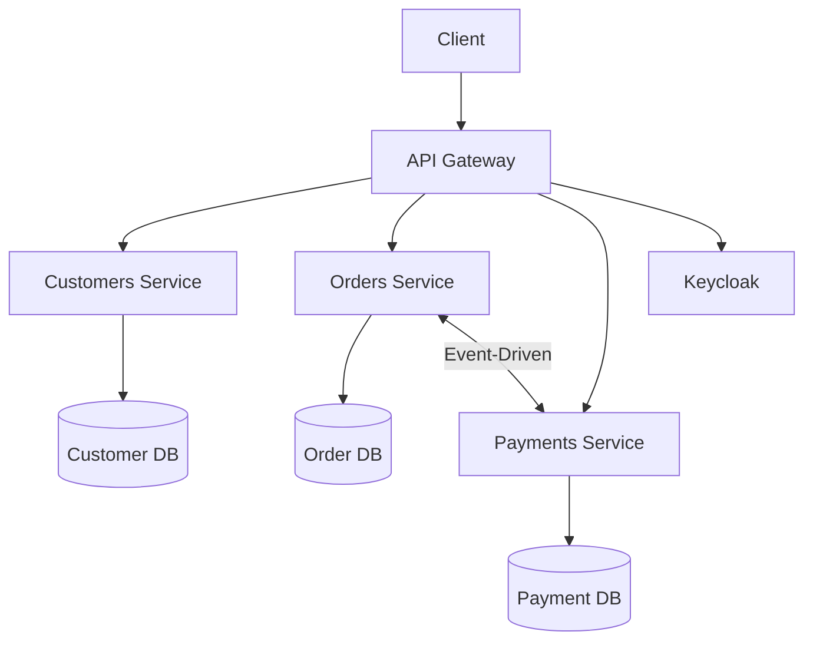

# ToDay-Shop 🛍️
سیستم فروشگاه آنلاین مبتنی بر میکروسرویس


## فهرست 📚
- [معماری کلی](#معماری-کلی-)
- [سرویس‌ها](#سرویسها-)
- [پیکربندی محیط](#پیکربندی-محیط-)
- [اجرای پروژه](#اجرای-پروژه-)
- [احراز هویت](#احراز-هویت-)
- [API Gateway](#api-gateway-)
- [دیتابیس‌ها](#دیتابیسها-)

## معماری کلی 🏗️


ویژگی‌های کلیدی:
- **الگوی CQRS** در سرویس‌های اصلی
- **Event Sourcing** برای تراکنش‌های مالی
- **API Gateway** با Ocelot
- **احراز هویت متمرکز** با Keycloak
- **ایزوله بودن دیتابیس** هر سرویس

## سرویس‌ها 🛠️
### 1. Customers Service 👥
- **تکنولوژی**: .NET 9
- **مسیر**: `/Customers`
- **وظایف**:
  - مدیریت پروفایل کاربران
  - احراز هویت سطح سرویس
  - اعتبارسنجی مشتریان

### 2. Orders Service 📦
- **تکنولوژی**: .NET 9
- **مسیر**: `/Orders`
- **وظایف**:
  - مدیریت چرخه عمر سفارشات
  - هماهنگی پرداخت‌ها
  - پیاده‌سازی الگوی Saga

### 3. Payments Service 💳
- **تکنولوژی**: .NET 9
- **مسیر**: `/Payments`
- **وظایف**:
  - پردازش تراکنش‌ها
  - یکپارچه‌سازی با درگاه‌های پرداخت
  - مدیریت Event Sourcing

### 4. API Gateway 🚪
- **تکنولوژی**: .NET 9 + Ocelot
- **مسیر**: `/Gateway`
- **وظایف**:
  - مسیریابی هوشمند
  - اعتبارسنجی JWT
  - Load Balancing

## پیکربندی محیط ⚙️
### فایل‌های .env
```ini
# .env.Development
KEYCLOAK_URL=http://localhost:8080
CUSTOMERS_DB=Server=customers_db;Database=Customers;User=sa;Password=YourStrong@Pass
ORDERS_DB=Server=orders_db;Database=Orders;User=sa;Password=YourStrong@Pass
PAYMENTS_DB=Server=payments_db;Database=Payments;User=sa;Password=YourStrong@Pass
```

## اجرای پروژه 🚀
1. کلون ریپازیتوری:
```bash
git clone https://github.com/MiladBhrlo/ToDay-Shop.git
```

2. اجرای سرویس‌ها:
```bash
docker-compose --env-file .env.production up --build
```

3. دسترسی به سرویس‌ها:
- API Gateway: `http://localhost:5000`
- Keycloak Admin: `http://localhost:8080/admin`
- Customers Service: `http://localhost:5000/api/customers`
- Orders Service: `http://localhost:5000/api/orders`
- Payments Service: `http://localhost:5000/api/payments`

## احراز هویت 🔐
### تنظیمات Keycloak
تنظیمت پیشفرض در فایل `/keycloak/realms/today-shop-realm.json`


### نمونه درخواست احراز هویت
```http
POST /realms/ToDayShopRealm/protocol/openid-connect/token
Content-Type: application/x-www-form-urlencoded

client_id=today-shop-gateway
&client_secret=YourSecret
&grant_type=password
&username=user
&password=pass
```

## API Gateway 🌐
### نمونه مسیریابی در ocelot.json
```json
{
  "Routes": [
    {
      "DownstreamPathTemplate": "/api/customers/{everything}",
      "DownstreamScheme": "http",
      "DownstreamHostAndPorts": [
        {
          "Host": "customers",
          "Port": 80
        }
      ],
      "UpstreamPathTemplate": "/api/customers/{everything}",
      "AuthenticationOptions": {
        "AuthenticationProviderKey": "Keycloak"
      }
    }
  ]
}
```

## دیتابیس‌ها 🗃️
| سرویس       | نوع دیتابیس   | آدرس Connection String       |
|-------------|---------------|-------------------------------|
| Customers   | PostgreSQL    | Host=orders_db;Database=...   |
| Orders      | PostgreSQL    | Host=orders_db;Database=...   |
| Payments    | PostgreSQL    | Host=orders_db;Database=...   |
